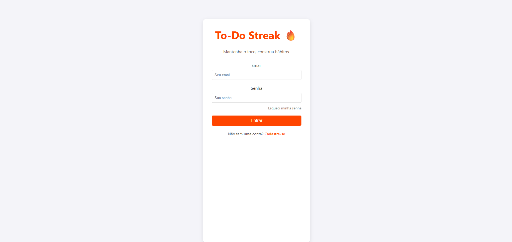
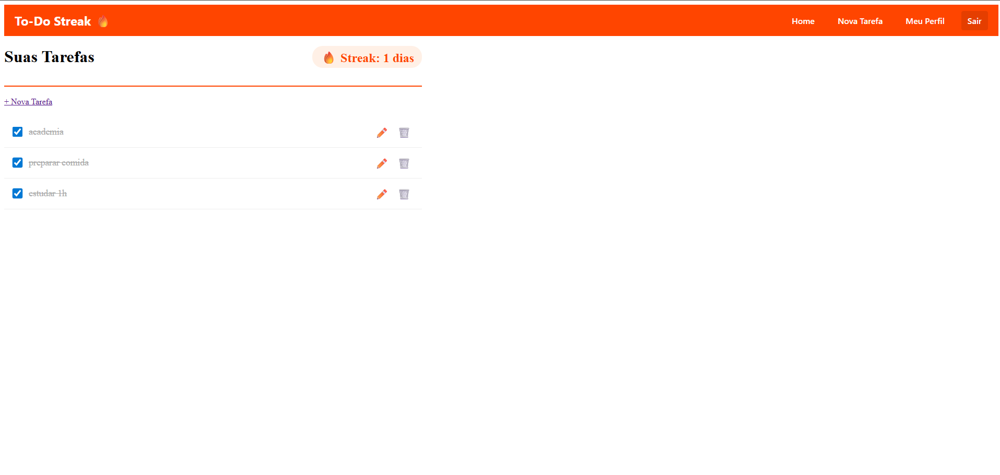
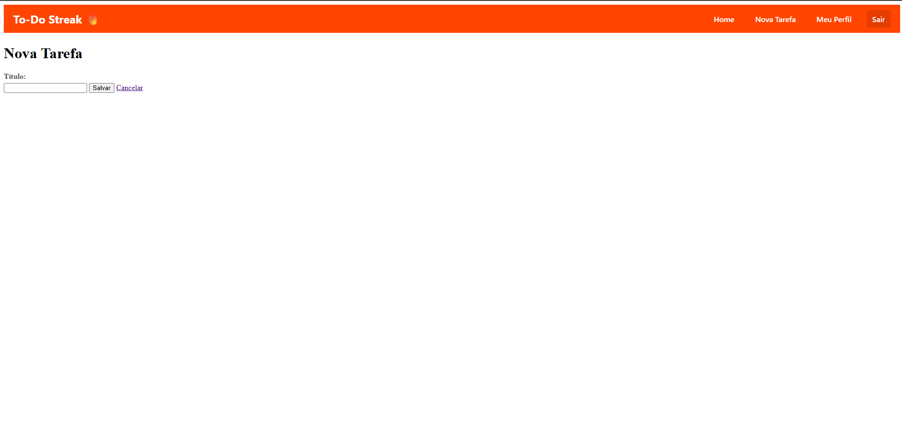

# To-Do Streak 🔥

Uma plataforma web de lista de tarefas (To-Do List) focada em construir e manter hábitos através de um sistema gamificado de "streaks" (sequências).

Este projeto foi desenvolvido como o Segundo Trabalho de Programação para Web (2025/2).

## Integrantes

Vinícius Machado da Rocha Viana – Matrícula: 2111343

Filipe Rogenfisch Quintans – Matrícula: 2020857

## Descrição do Projeto

O To-Do List Gamificada é uma aplicação web que une um backend em Django (servindo uma API REST) e um frontend em HTML/CSS/TypeScript.

A ideia central é simples: o usuário cadastra suas tarefas diárias. Para cada dia que ele consegue completar todas as tarefas da sua lista, o seu contador de "streak" (sequência) aumenta em +1. Caso um dia termine e o usuário não tenha completado todas as tarefas, seu "streak" é zerado.

O objetivo é incentivar a consistência e a criação de hábitos diários de forma lúdica e recompensadora.

## Funcionalidades

### Gerenciamento de Usuários Completo:
Cadastro de novas contas.
Autenticação (Login/Logout).
Funcionalidade de "Esqueci minha senha" para recuperação/troca.

### Gerenciamento da Lista de Tarefas (CRUD):
Criar novas tarefas na lista principal.
Editar o texto de tarefas existentes.
Excluir tarefas que não são mais necessárias.

### Interação com a Lista:
Marcar tarefas como concluídas ou pendentes.
Reordenar tarefas na lista (arrastar e soltar ou mover para cima/baixo).

### Sistema de Gamificação (Streak):
Contador de "streak" visível que incrementa +1 a cada dia 100% concluído.
Reset automático do "streak" para 0 caso o usuário falhe em completar o dia.

### Reset Diário:
O "check" (marcação de concluído) de todas as tarefas é resetado automaticamente todo dia (à meia-noite), permitindo que a lista seja refeita no dia seguinte.

## Tecnologias Utilizadas

Backend: Django (API REST com Django Rest Framework)
Frontend: HTML5, CSS3, TypeScript
Banco de Dados: SQLite (padrão) / PostgreSQL (via Docker)
Documentação da API: Swagger / OpenAPI (integrado ao DRF)
Autenticação: Sistema de autenticação do Django (Tokens ou Sessão)
Infraestrutura: Docker & Docker Compose

## Como Usar (Docker)
### Pré-requisitos:
Docker
Docker Compose

### Passo a Passo (Docker Compose)
Para rodar a aplicação completa (Backend + Frontend) utilizando as imagens publicadas:

1. Crie um arquivo chamado `docker-compose.yml` na raiz de uma pasta vazia com o seguinte conteúdo:

```yaml
version: '3.8'
services:
  backend:
    image: [SEU_USUARIO_DOCKERHUB]/todostreak-back:v1
    ports:
      - "8000:8000"
  frontend:
    image: [SEU_USUARIO_DOCKERHUB]/todostreak-front:v1
    ports:
      - "8080:80"
```

2. Abra o terminal na mesma pasta e execute:
   `docker-compose up`

3. Acesse a aplicação:
   * **Frontend:** http://localhost:8080
   * **Backend API:** http://localhost:8000

## Instruções Backend

Para construir a imagem do zero e rodar o container do backend isoladamente:

1. Navegue até a pasta do código:
   `cd Backend/Code`

2. Construa a imagem Docker (substitua `[SEU_USUARIO]` pelo seu usuário do Docker Hub):
   `docker build -t [SEU_USUARIO]/todostreak-back:v1 .`

3. Envie para o Docker Hub (requer login):
   `docker push [SEU_USUARIO]/todostreak-back:v1`

4. Rode o container:
   `docker run -d -p 8000:8000 [SEU_USUARIO]/todostreak-back:v1`

## Instruções Frontend

 Para construir a imagem do zero e rodar o container do frontend isoladamente:

1. Navegue até a pasta do código:
   `cd Frontend/Code`

2. Construa a imagem Docker:
   `docker build -t [SEU_USUARIO]/todostreak-front:v1 .`

3. Envie para o Docker Hub (requer login):
   `docker push [SEU_USUARIO]/todostreak-front:v1`

4. Rode o container (a porta interna 80 é mapeada para a 8080):
   `docker run -d -p 8080:80 [SEU_USUARIO]/todostreak-front:v1`


Acessando a Aplicação

Frontend: http://localhost:PORTA_FRONT

Backend API: http://localhost:PORTA_BACK/api/

Documentação (Swagger): http://localhost:PORTA_BACK/swagger/

📖 Manual do Usuário

1. Cadastro e Login

Para começar, crie uma conta fornecendo seu e-mail e definindo uma senha.

Após o cadastro, faça login para acessar sua lista de tarefas pessoal.

2. Recuperação de Senha

Caso esqueça sua senha, clique em "Esqueci minha senha" na tela de login.

Siga as instruções (geralmente enviadas ao seu e-mail) para definir uma nova senha.

3. A Página Principal (Sua Lista)

Ao logar, você verá sua lista de tarefas.

No topo da página (ou em local de destaque), você encontrará seu Contador de Streak, mostrando há quantos dias consecutivos você completa suas metas.

4. Gerenciando Tarefas

Adicionar: Use o campo de entrada para digitar o nome da sua nova tarefa e confirme.

Editar: Clique no ícone de edição (ou no próprio texto da tarefa) para alterar sua descrição.

Reordenar: (Descrever como a reordenação funciona, ex: "Clique e arraste a tarefa para a posição desejada").

Excluir: Clique no ícone de lixeira ou "X" para remover uma tarefa da lista.

5. Completando o Dia e o Streak

Conforme você completa suas tarefas, marque a caixa de "check" ao lado de cada uma.

Ao marcar a última tarefa pendente do dia, seu contador de "streak" aumentará em +1. Parabéns!

Se o dia terminar e houver tarefas não marcadas, seu "streak" será resetado para 0 no dia seguinte.

6. O Reset Diário

Todo dia, à meia-noite, todas as suas tarefas voltarão ao estado "pendente" (desmarcadas), prontas para você começar um novo dia!

🖼️ Imagens

(Mínimo de 3 imagens do site)

Imagem 1: (Tela de Login ou Cadastro)


Imagem 2: (Tela Principal com a Lista de Tarefas e o Streak)


Imagem 3: (Tela de Edição de Tarefa ou Recuperação de Senha)


## Documentação da API (Swagger)

Após instalar dependências e rodar o servidor de desenvolvimento, a documentação automática estará disponível em:

- Especificação OpenAPI (JSON/YAML): [http://localhost:8000/api/schema/](http://localhost:8000/api/schema/)
- Swagger UI (interativo): [http://localhost:8000/api/docs/](http://localhost:8000/api/docs/)
- Redoc (alternativa): [http://localhost:8000/api/redoc/](http://localhost:8000/api/redoc/)

Visite esses links para inspecionar e testar os endpoints da API diretamente pelo navegador. Use o botão **Authorize** na Swagger UI para fornecer um token `Bearer <access_token>` e testar endpoints protegidos.
